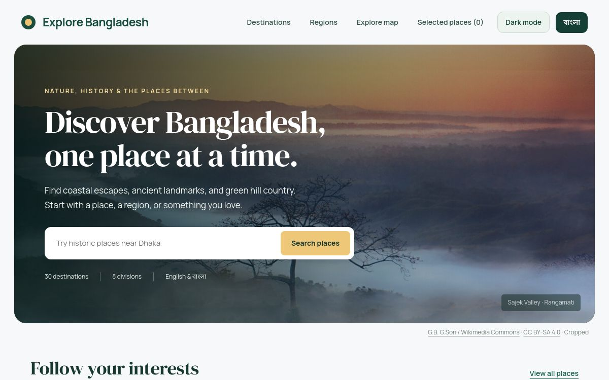

# Explore Bangladesh

A bilingual travel guide to 30 destinations across Bangladesh, with photographs, smart search, maps, detailed guides, selected places, and dark mode.

[Visit the website](https://explore-bangladesh-doniel.donieltripura1971.chatgpt.site)

## Run locally

```sh
python3 -m http.server 8000 --directory public
```

Open http://localhost:8000. No API key or build is required.

## Project structure

- `public/`: website pages
- `public/assets/css/`: application styles
- `public/assets/js/`: search, map, page rendering and theme logic
- `public/assets/images/`: destination photographs
- `public/assets/data/destinations.json`: bilingual guides, sources and image credits
- `public/assets/vendor/leaflet/`: third-party map library
- `docs/`: photo attribution
- `scripts/build.py`: copies the deployable website into `dist/`

## Build

```sh
python3 scripts/build.py
```

## Credits

Photographs retain their individual licenses. See [image credits](docs/IMAGE_CREDITS.md). Leaflet uses its BSD 2-Clause license. Maps use OpenStreetMap tiles and attribution.
## Product screenshot



